# つなぐん — アプリ設計書 / Codex引き継ぎ

- 版：v2.0（手書きラフ・直近の画面修正反映版）
- 作成日：2026-09-26
- 対象：Android向け、一回限りのイベント用アイスブレイクアプリ
- 本書の位置づけ：これまでの会話を実装に渡すための整理。アプリの実装完了報告ではない。
- 資料上の呼称：つなぐん。正式なアプリ表示名・ロゴの最終承認とは分けて扱う。

> **最初に読むこと**
>
> 本書では、ユーザーが明示した要件と、AIが実装のために提案した内容を分離する。
> 「暫定案」を実装に利用しても、それをユーザーの確定判断として記録しない。
> 対戦ゲーム・協力ゲームの内容は未決定であり、今回は空の差し込み領域を用意する。
> 同梱の過去の生成画像は参考資料であり、画像内に描かれている機能をそのまま追加しない。

---

## 0. 仕様の読み方と優先順位

### 0.1 ステータス

| 表記 | 意味 | Codexの扱い |
|---|---|---|
| **確定 C** | ユーザーの明示的な指定・承認がある要件、または承認された方針 | 実装の基準とする。変更が必要なら差分を明示する。 |
| **暫定 P** | AIの具体案、または詳細が委ねられている部分の仮置き | 差し替え可能な形で利用できる。ユーザー承認済みと記載しない。 |
| **未決定 U** | 内容や条件がまだ定まっていない事項 | 勝手に確定しない。進行を止めない範囲で空欄・設定・代替実装を用意する。 |
| **変更 X** | 以前の案・画像・整理から更新された箇所 | 旧仕様を混在させない。 |

優先順位は、**最新のユーザーの明示的な修正 → 有効な過去のユーザー指定 → 手書きラフ → 暫定実装案 → 過去の生成画像**とする。ユーザーが撤回していない過去の承認を、「最新の発言で再承認されていない」という理由だけで未決定へ戻さない。

### 0.2 今回の整理における訂正

直前の文章版には、承認状態の整理が不正確な箇所があったため、以下を明示して修正する。新しい仕様の追加ではない。

| 項目 | 本書での整理 | 会話上の根拠 |
|---|---|---|
| 普通の子分＝3、骨＝1 | **確定** | この重みの提案に対し、ユーザーは回答の3番で「その通りでいいです」と承認した。 |
| 一台用デモ・検証モード | **方針は確定** | 一台でも動くデモ、通常版とのルール共通化を含む提案に対し、「ではその方針でアプリの設計書を作成し」と依頼があった。デモの細かな操作UIまで個別に承認されたという意味ではない。 |
| ルーム作成・参加と開始待ち | **削除しない** | 手書きラフへの確認で、役割分担には「おけ」、チーム画面には「交流開始をまつで行きましょう」と回答があった。プロフィールから即ホームに飛ぶ説明だけでは不足する。 |
| 入力欄の「開けておいて」 | **初期表示から入力でき、入力中に即時反映することが確定** | 新規入力値を空文字にすることも本書では採用を提案するが、折りたたみ状態と入力値の有無を混同しない。 |
| 広い方針への同意 | **詳細案すべての個別承認にはしない** | 「提案はある程度飲み込んで実装」「その方針」は進め方への同意として扱い、報酬の細則などは引き続き暫定に分ける。 |

---

## 1. コンセプトと利用場面

### 1.1 コンセプト

**テーマ：ツナ缶でつながる。**

初対面の参加者が目の前の人と遊び、その出会いが子分としてツナ缶に残る。同じチームの相手とは協力し、別チームの相手とは対戦する。最後に集まった子分の力をチームで合計し、綱引きで締めくくる。

「はだ缶に自分のプロフィールが巻かれる」「ツナが骨になってショBONE」「子分がよろしく(ツ)ナと登場する」といった、ツナ・つながる・綱引き・骨の言葉遊びを体験にする。

### 1.2 利用者と利用単位

| 項目 | 内容 |
|---|---|
| 参加者 | イベントなどに集まった、初対面を含む数十人 |
| 主催者 | ルームとイベント進行を管理する人 |
| 利用単位 | 一回のルーム・イベント |
| 個別の交流 | 二人一組 |
| 全体の構成 | 二チーム |
| 対応端末 | Android |
| 継続利用の前提 | 置かない。週間・月間・全期間ランキングは作らない。 |
| 開発上の制約 | 一晩での開発を想定。装飾と画面の作り込みを抑え、体験と主要ルールに集中する。 |

一回限りの用途であることと、データをいつ削除するかは別事項である。保存期間・削除タイミングは未決定として扱う。

---

## 2. 確定事項

### 2.1 イベント・ゲーム・報酬

| ID | 確定内容 | 適用範囲・注意 |
|---|---|---|
| C01 | Androidのみを対象とする。 | iOS対応を追加しない。 |
| C02 | 主催者がいる形式で、数十人が参加するルームを利用する。 | 主催者用のすべての操作項目が確定しているわけではない。 |
| C03 | 初めに二チームへ分かれる。 | 自動・手動などの分け方は暫定／未決定。 |
| C04 | 同チームの相手とは協力ゲーム、別チームの相手とは対戦ゲームを行う。 | ゲームの具体的な内容は未決定。 |
| C05 | 対戦の勝者には普通の子分、敗者には弱い子分である骨を新しく付与する。 | 相手の子分を奪って減らす方式ではない。引き分け時の扱いは未決定。 |
| C06 | 協力成功時には、骨が普通の子分ツナへ復活・成長する。 | 何匹を対象にするか、骨がない場合や協力失敗時の扱いは未決定。 |
| C07 | 子分には交流相手を振り返るためのプロフィールを持たせる。 | 勝利時の相手情報を残す方針が明示されている。敗者・協力時の具体的な割当方法は暫定案に分ける。 |
| C08 | 成長は子分が増えること、骨が普通になることで表す。大量になったら「×数字」のように省略表示できる。 | 親分のレベル・装備などは追加しない。表示上の省略と、相手情報の削除を混同しない。 |
| C09 | 最終綱引きは、普通＝3、骨＝1の重みで集計した二チームの戦力で勝敗を決める。 | 最後の連打や抽選で勝敗を変えるゲームにはしない。 |
| C10 | 主催者が設定した時間が終了したら、最終綱引きへ進む。 | 終了時に進行中のゲームがある場合の処理は暫定案。 |
| C11 | 最後にMVP・ランキングを表示する。ランキングの対象は今回のルームのみ。 | 算出基準、同順位、表示件数などは未決定。画面のまとめ方は委ねられている。 |
| C12 | ハートなどを送り合う機能は入れない。 | ひとことコメントはプロフィールの一部とする。 |

### 2.2 画面・キャラクター・演出

| ID | 確定内容 | 適用範囲・注意 |
|---|---|---|
| C13 | 最初のツナ缶はラベルのない「はだ缶」。プロフィールがラベルになり、自分専用のツナ缶になる。 | 初期状態から名前などが印刷された缶を出さない。 |
| C14 | プロフィールはニックネーム・趣味・ひとことの三項目。入力UIを初めから開き、入力内容をラベルに即時反映する。 | 必須／任意、文字数制限、更新保存の細則は暫定／未決定。 |
| C15 | 開始前は交流開始を待つ。 | 開始待ちを、独立した交流機能や作戦会議機能へ拡張しない。 |
| C16 | 交流中のホームは手書きラフ13ページを基準にする。メンバー表示・メンバーへの導線と下部タブは不要。 | 13ページに描かれたメンバーボタンは、最新指示によって削除対象になった。 |
| C17 | 相手とつながると、親分ツナが缶から飛び出して缶の上に立つ。ミニゲーム中は缶とキャラクターが小さく右下へ移動する。 | ミニゲームの内容はこの配置とは別に未決定。 |
| C18 | 対戦に勝つと親分ツナが缶の上で踊る。負けると「ショBONE」を表示し、ツナのキャラクターが骨になる。 | 親分の骨化がいつ解除されるかは未決定。骨の子分の所持状態とは分けて扱う。 |
| C19 | 勝利時に新しい子分が現れ、「よろしく(ツ)ナ」と話す。その後、親分と一緒に缶へシュッと吸い込まれるように入る。 | 固定セリフと、参加者が入力するひとことは別データ。 |
| C20 | 子分登場の場面に「ホームに戻る」ボタンを設置する。 | ボタン操作と吸い込み演出の厳密な開始順は暫定案で整理する。 |
| C21 | 協力成功時は、復活した子分ツナが親分と一緒に缶へ戻る。 | 成長対象の選択などは未決定。 |
| C22 | 背景やUIはシンプルにし、キャラクターと缶を主役にする。場面が流動的につながって見えることを重視する。 | グレー・黒は許容された方向。色・書体・余白の具体値はまだ確定していない。 |
| C23 | 一台でも検証・発表できるモードを用意する方針。通常版と画面・ルールを共通にし、相手だけを仮想参加者に置き換えられるようにする。 | デモの細かな操作や人数は暫定。通常の数十人利用の完全オフライン対応を意味しない。 |
| C24 | 接続時に相手を取り違えないよう確認する。 | NFCでの確認操作省略は可能性として言及されただけで、採用は未決定。 |
| C25 | 対戦ゲーム・協力ゲームの中身は後から入れるため、今回は空けておく。 | 過去の画像に描かれた魚タップ、ジャンプ、タイミングリング等を正式ゲームとして採用しない。 |

---

## 3. 暫定案 — 承認済みの決定に置き換えない

以下は、実装を進めるために本書で整理した仮置きである。変更可能な設定・分岐として扱う。

| ID | 暫定案 | 意図・変更時の影響 |
|---|---|---|
| P01 | 最初のテーマはマットな明るいグレー一色。文字は読みやすい通常の書体。 | 黒を含む複数テーマを同時実装しない。最終配色は未承認。 |
| P02 | 新規プロフィールは三項目とも空文字で開始。ニックネーム・趣味を必須、ひとことを任意とする。 | サンプル値で本人の情報を埋めない。必須／任意や文字数上限は設定へ分離する。 |
| P03 | 開始時に人数がほぼ均等になるようランダムに二チームへ割り振り、開始後は固定する。 | 分け方と途中参加の扱いは未確定。 |
| P04 | オンラインのルーム管理を初期構成とし、相手指定はQR＋短いコード入力を先に成立させる。NFCは別途実機検証する。 | サーバー製品や通信ライブラリは確定していない。GPSだけで目の前の相手を決める案は採用しない。 |
| P05 | 同じ相手とゲームを完了したら、そのルーム中は再戦できない。再接続では相手プロフィールを表示する。 | ユーザーの「再戦しない」方向に合わせた初期案。代案も提示されているため、厳密なルールは固定承認扱いにしない。通信失敗からの復帰は再戦と区別する。 |
| P06 | 協力終了時は双方に相手プロフィールを持つ骨を一匹追加。成功時は、それぞれ既存の骨一匹を普通にする。既存の骨がなければ今回の骨を成長させる。 | 協力でも出会いを一匹で残すためのAI案。協力失敗時にも骨を得ること、対象数、対象の選び方はユーザー確定ではない。 |
| P07 | P06の成長対象は古い骨を優先する。成長時にプロフィールを上書きしない。 | 選択UIを増やさないための案。協力相手と元の子分の由来を混同しない。 |
| P08 | 親分の「ショBONE」は結果演出だけの状態にし、ホーム帰還後は通常の親分へ戻す。敗北報酬の骨子分は残す。 | 次の交流を妨げないための案。親分を永続的な骨状態にするかは未決定。 |
| P09 | 子分の到着・プロフィールを見せ、「ホームに戻る」を押すと吸い込み演出を行い、ホームへ戻る。 | 自動帰還と帰還ボタンの関係を整理する仮案。結果確認中に即座に自動退出させない。 |
| P10 | MVP・ルーム順位は最終戦力を仮の基準とし、同点は同順位にする。 | 算出基準は未決定。個人の最終戦力が「対戦勝利数」だけを意味するとは表示しない。 |
| P11 | 子分のプロフィールは交流時点の値を保存する。勝者・敗者の両方で、相手のプロフィールを保持する。 | 過去の子分が後から別の人物情報へ書き換わることを避ける実装案。協力時の割当はP06に従う。 |
| P12 | 期限到達後は新しい交流を止め、進行中ゲームのみ有限の猶予で結果確定を待つ。集計を確定してから綱引きへ移る。 | 猶予時間・未完了時の扱いは設定とする。時間切れで画面だけを切り替えて報酬処理を捨てない。 |
| P13 | 一回確定したゲーム結果から、報酬を一度だけ反映する。通信切断を自動的な敗北にはしない。 | 処理の重複や切断時の不利益を防ぐ実装案。タイムアウト等の細則は未決定。 |
| P14 | 開始待ちは、ルーム・自分のチーム・開始待ちの案内を中心にする。 | ホームのメンバー削除指示を踏まえ、メンバー一覧を新しく増やさない。 |
| P15 | 綱引き、勝利チーム、MVP、ルーム順位は一つの最終イベント画面の段階表示にまとめる。 | 画面構成を任せるという指定に対する実装案。全部を別ページにする必要はない。 |

### 3.1 協力報酬案の注意

P06を採用すると、成功した一人あたりの戦力増加は「新しい骨で+1、骨の成長で+2」の合計+3になる。二人は同チームなので、チーム全体では+6となる。

これは暫定案の計算結果であり、バランスが適切だと確認できたわけではない。協力ゲームの所要時間・成功率が未定のため、対戦と協力の優劣は実装後に確認する。調整のために勝手に回数制限や別通貨を追加しない。

---

## 4. 未決定事項

| ID | まだ決まっていない内容 | 現時点の進め方 |
|---|---|---|
| U01 | 対戦ゲームの操作、ルール、制限時間、勝敗判定、引き分けの扱い | 差し替え可能な空領域。通常モードで偽の勝敗を発生させない。 |
| U02 | 協力ゲームの操作、ルール、成功／失敗の条件 | 同上。対戦とは別のゲーム実装を差し込めるようにする。 |
| U03 | 協力報酬の対象数、骨がない場合、協力失敗、協力相手のプロフィールの残し方 | 検証ではP06・P07を明示して使えるようにする。 |
| U04 | 親分が骨になった後、いつ通常状態へ戻るか | P08で仮置き。親分の見た目と骨子分の所持状態は分ける。 |
| U05 | 自動／手動のチーム分け、途中参加、主催者自身の参加、途中退出 | P03・P14をたたき台とし、条件を一か所へまとめる。 |
| U06 | NFCの採否、対象機種、接続方式の最終選定 | QR等の代替経路を残す。未検証の方式を動作確認済みと表現しない。 |
| U07 | 対戦・協力で集めた子分を使う個人戦の能力補正 | 初期案は補正なし。ゲーム内容を決める際に再確認する。 |
| U08 | MVP・ランキングの算出基準、表示件数、同点時の表彰 | ルーム限定という範囲だけは変更しない。P10を設定化する。 |
| U09 | 入力の必須項目、文字数上限、途中保存、参加後のプロフィール編集 | P02を仮置き。画面上の入力欄とラベルの即時反映を優先する。 |
| U10 | データの保存期間、イベント後の閲覧・削除、プロフィールの公開範囲 | 一回限りの利用と自動削除を同義にしない。不要な連絡先等を追加しない。 |
| U11 | 最終配色、書体、缶素材、アニメーション時間、音 | 素材とテーマを差し替えやすくし、装飾を増やしすぎない。 |
| U12 | 主催者の手動終了・時間延長、端末切断時の終了処理 | 期限による終了は確定。追加操作は必要性を見て決める。 |
| U13 | 永続化方式・サーバー製品・具体的な技術構成 | 既存リポジトリを確認して提案する。Firebase等をユーザー指定とみなさない。 |

---

## 5. 以前の案からの変更点

画像内に描かれていただけの要素を、過去の承認済み仕様として扱わない。

| ID | 以前の案・画像 | 今回有効な内容 |
|---|---|---|
| X01 | 初めから印刷済みのツナ缶 | 最初は無地の「はだ缶」。プロフィールが自分のラベルになる。 |
| X02 | サンプルプロフィールが入力済みの静的プレビュー | 初期表示から入力でき、入力の途中でラベルへ即時反映する。新規入力値は空欄での開始を提案する。 |
| X03 | ホームのメンバー表示・メンバーボタン | 不要。手書き13ページの構図を使うが、この部分は削除する。 |
| X04 | ホーム・交流・通知等の下部タブ | 不要。下部タブを前提に画面を分けない。 |
| X05 | 交流相手を探す専用ホームを別途増やす | 手書き13ページ相当の缶ホームを拠点に統合する。 |
| X06 | 画像内の魚タップ、ジャンプ、タイミングゲーム | 未採用。対戦・協力の中身は空けておく。 |
| X07 | ゲーム中も缶を中央へ大きく表示 | ゲーム時は缶と親分を小さく右下へ移動する。 |
| X08 | 勝利／敗北の文字だけを表示 | 勝利は缶上で踊る。敗北は「ショBONE」と骨化。 |
| X09 | 子分獲得を数字の加算だけで表現 | 子分が登場し「よろしく(ツ)ナ」。親分と一緒に缶へ吸い込まれる。 |
| X10 | 子分演出後に自動で戻るだけの導線 | 子分登場場面に「ホームに戻る」を必ず置く。吸い込みとの順番はP09で仮置き。 |
| X11 | 主催者が任意に終了を押すことだけを前提 | 主催者が設定した期限で最終綱引きへ進む。手動操作は追加検討。 |
| X12 | 週間・月間・全期間ランキング、継続記録 | 今回のルームの順位のみ。期間切替を作らない。 |
| X13 | 再戦・リプレイのボタンがある生成画像 | 標準導線としては追加しない。再戦の細則はP05／Uの扱いを確認する。 |
| X14 | ポップな背景、泡、海辺、小物、装飾の多い画面 | シンプルな背景。キャラクターと缶、意味のある動きに集中する。 |
| X15 | デモや戦力の重みを未決定へ戻した直前の文章 | 一台用デモの方針と普通3・骨1は、過去の承認を有効として扱う。 |

---

## 6. 利用者の操作と画面の変化

以下の「画面」は利用者に見える場面であり、それぞれを別の画面遷移・別ルートに実装する指定ではない。特にホーム、ゲームへの移動、結果、缶への帰還は、缶と親分が連続して動く構成を優先する。

### 6.1 全体の流れ

```text
ルーム作成／参加（はだ缶）
  ↓
プロフィール入力 → 入力中にラベルが更新
  ↓
交流開始待ち・二チームへの所属
  ↓ 主催者が開始
缶ホーム（手書き13ページを基準）
  ↓ 接続操作
相手確認
  ├─ 別チーム → 対戦ゲーム領域【中身は未実装】
  │                ├─ 勝利 → 缶の上で踊る → 普通の子分が登場
  │                │                          「よろしく(ツ)ナ」
  │                └─ 敗北 → ショBONE・親分の骨化 → 骨の報酬
  │
  └─ 同チーム → 協力ゲーム領域【中身は未実装】
                   ├─ 成功 → 骨が普通の子分へ復活
                   └─ 失敗 → 未決定（検証時は暫定ルール）
  ↓
ホームに戻る操作 → 親分・子分が缶へ吸い込まれる
  ↓
缶ホームへ戻り、別の相手を探す

主催者設定の期限に到達
  ↓ 新規交流の受付を停止
結果確定・最終集計【終了時の扱いは暫定】
  ↓
二チームの綱引き → 勝利チーム → MVP → 今回のルーム順位 → 退出
```

対戦敗北時の骨報酬の見せ方、協力失敗時の結果、親分が通常へ戻るタイミングは未確定部分を含む。上記の流れを、すべてユーザーが細部まで承認した演出として扱わない。

### 6.2 S01：ルーム作成／参加

**根拠：手書きラフ2ページ＋その役割についてのユーザー承認。**

| 順番 | 利用者の操作 | 画面の変化 |
|---|---|---|
| 1 | アプリを開く。 | ラベルのない「はだ缶」と、ルーム作成／参加の入口を表示する。入口の具体的配置は暫定。 |
| 2-A | 主催者がルームを作成し、イベント時間を設定する。 | ルームの参加情報が得られる。時間の選択肢や初期値は未決定。 |
| 2-B | 参加者がルームID等を入力して参加する。 | 対象ルームのプロフィール作成へ進む。ID形式は未決定。 |

スタート専用画面を追加するかは実装上の判断とする。ルーム参加の処理を省略してホームへ直行させない。

### 6.3 S02：ツナ缶作成／プロフィール入力

**確定：C13・C14。空欄・必須項目の細則：P02。**

| 順番 | 利用者の操作 | 画面の変化 |
|---|---|---|
| 1 | 画面を開く。 | 入力欄が初めから見えており、そのまま入力できる。新規作成時は空欄から始める案。缶ははだ缶。 |
| 2 | ニックネームを入力・修正する。 | 確定ボタンを押す前に、缶のラベルの名前が入力値に合わせて変わる。 |
| 3 | 趣味、ひとことを入力・修正する。 | 各項目がラベルに即時反映される。固定のサンプル文で上書きしない。 |
| 4 | 入力内容を決定する。 | プロフィールを保存し、自分用の缶として交流開始待ちへ進む。保存に失敗した場合は入力を保つ案。 |

**実装案：** 入力値とラベルプレビューは同じ編集状態を参照する。キー入力ごとのネットワーク保存を、即時プレビューの必須条件にしない。全項目が空ならはだ缶、何か入力されたらラベルが見える構成を提案する。

ラベルを本物の円筒に巻き付ける3D処理は要件ではない。最初は2Dの缶画像にラベル領域を重ねる実装でよい。文字あふれとキーボード表示時の見え方は確認する。

### 6.4 S03：交流開始待ち

**確定：C03・C15。表示の省略案：P14。**

参加者はルームで開始を待つ。主催者の開始後にホームへ進む。チーム分けの実行時点・方法はP03で仮置きする。

ホームのメンバーボタンは削除済みであり、待機画面を理由にメンバー管理・チャットなどを追加しない。待機中に何人の名前まで見せるかは承認された必須機能ではない。

### 6.5 S04：缶ホーム／交流相手を探す

**確定：C16。構図の参考：手書きラフ13ページ。**

表示の中心は、本人のプロフィールラベルが付いた缶。ここを繰り返し戻る拠点にする。

| 要素 | 扱い |
|---|---|
| 自分の缶とラベル | 必須。別のプロフィールカードを大量に並べる方向にしない。 |
| 自分のチーム | 表示する初期案。色だけに依存せずチーム名も示す。 |
| 残り時間 | 表示する初期案。端末の表示だけでイベントを確定しない。 |
| 普通・骨の数 | 種類別の集約表示を提案。人数が多くても全員を常時描画しない。 |
| 接続への入口 | 必須。QR表示／読み取りなどの詳細は暫定。 |
| 子分のプロフィール | 子分や個数表示をタップして下から詳細を出す案。独立タブにはしない。 |
| メンバー表示・メンバーボタン | **入れない。** |
| 下部タブ | **入れない。** |

通常は親分が缶の中にいる。相手確認後に缶から飛び出すことで、交流開始を見せる。

### 6.6 S05：接続と相手確認

| 順番 | 利用者の操作 | 画面の変化 |
|---|---|---|
| 1 | ホームでつながる操作を選ぶ。 | QR表示・読み取り、または別方式の接続UIを開く。 |
| 2 | 目の前の相手を指定する。 | 相手候補のニックネームとチームを表示する。 |
| 3 | 相手を確認して開始する。 | 同じルームか、進行中の別ゲームがないか等を確認する初期案。 |
| 4 | 相手の所属に応じて進む。 | 同チームなら協力、別チームなら対戦の場面になる。親分が缶から出る。 |

確認の具体的なボタン数、双方承認の方式は実装案であり確定していない。QRが失敗したときのコード入力、カメラ許可がないときの代替導線を用意することを提案する。

NFCは、利用端末で成立するかを確認してから採用する。疑似接続を実際の端末間接続として見せない。

### 6.7 S06：ミニゲーム領域 — 現在は空ける

**確定：C17・C25。構図の参考：手書きラフ9ページ。**

ホームの缶と親分が縮小し、右下へ移動する。空いた中央・上側にゲームを差し込む領域を確保する。

- 対戦ゲームと協力ゲームは別々に差し替えられる構造にする。
- 正式なゲーム内容・操作ボタン・スコア方式は実装しない。
- 仮の魚タップやタイミングゲームを、正式採用として追加しない。
- 通常モードでは「ゲーム準備中」等で未搭載と分かるようにし、空画面のまま操作不能にしない。
- 検証モードにだけ、勝利・敗北・協力成功・協力失敗の結果を注入する操作を設ける案とする。

**重要：ゲームが未搭載の通常モードは、まだ本来の遊びを完走できない。一台用の結果再現はゲーム実装完了の代わりではない。**

### 6.8 S07-A：対戦勝利 → 子分登場 → 帰還

**確定：C18〜C20。演出開始順の一部はP09。**

| 順番 | 利用者の操作・イベント | 画面の変化 |
|---|---|---|
| 1 | 勝利結果が確定する。 | 缶と親分を見やすい位置へ戻し、親分が缶の上で踊る。 |
| 2 | 勝利演出の後へ進む。 | 新しい普通の子分が現れる。自動進行／追加ボタンの有無は暫定。 |
| 3 | 子分を見る。 | 子分が **「よろしく(ツ)ナ」** と話す。相手のプロフィールも確認できる構成を提案する。 |
| 4 | **「ホームに戻る」**を押す。 | 親分と子分が缶へシュッと吸い込まれる。ボタンで演出を始める順序はP09。 |
| 5 | 帰還が終わる。 | 手書き13ページ相当のホームへ戻り、子分数とプロフィールが反映される。 |

吸い込みは、缶の入口へ向かう移動・縮小・非表示で表現する案。毎回の手描きアニメーション素材や3D表現を必須にしない。

### 6.9 S07-B：対戦敗北 → ショBONE → 帰還

| 順番 | 利用者の操作・イベント | 画面の変化 |
|---|---|---|
| 1 | 敗北結果が確定する。 | **「ショBONE」**を表示し、親分の見た目が骨になる。 |
| 2 | 報酬を確認する。 | 新しい骨子分を獲得する。骨化した親分そのものを、獲得した子分として数えない。 |
| 3 | ホームへ戻る。 | 帰還の細かな演出は未決定。検証では共通の帰還操作を利用する案。 |
| 4 | ホームが表示される。 | 骨子分は所持したまま。親分を通常表示へ戻すのはP08であり、確定事項ではない。 |

負けた場合のセリフを、勝利時と同じ「よろしく(ツ)ナ」にするかは指定されていない。新しい文言を承認済みのコピーとして追加しない。

### 6.10 S07-C：協力成功 → 骨の復活 → 帰還

| 順番 | 利用者の操作・イベント | 画面の変化 |
|---|---|---|
| 1 | 協力成功が確定する。 | 成長対象の骨を見せる。対象の決め方は暫定。 |
| 2 | 復活演出が始まる。 | 骨が普通の子分ツナへ変わる。プロフィールの由来は変えない案。 |
| 3 | ホームへ戻る操作をする。 | 復活した子分と親分が一緒に缶へ戻る。 |
| 4 | ホームが表示される。 | 子分の種類・数・戦力を更新する。 |

協力失敗時の報酬・専用演出は未決定。P06を使う検証では骨を付与し、復活演出は発生させない。

### 6.11 S08：期限到達 → 最終綱引き

期限到達は、利用者のタップではなくイベント側の条件で起こる。

1. 新しい相手とのゲーム開始を止める。
2. 接続中・入力中・結果表示中など現在の場面に応じて、終了案内を表示する。
3. 進行中ゲームをどう締めるかはP12に従う。待ち続けないための上限を設ける案。
4. 子分の反映が済んだ集計を固定する。
5. 全員を二チームの綱引きへ案内する。
6. 合計戦力に基づく勝敗を演出する。

期限後に「ホームに戻る」が押された場合も、通常交流を再開させない。最新のルーム進行を見て、集計待ちまたは最終戦へ進める実装を提案する。

### 6.12 S09：勝利チーム → MVP → ルーム順位 → 退出

| 順番 | 利用者の操作・イベント | 画面の変化 |
|---|---|---|
| 1 | 綱引きが終わる。 | 勝利チームと両チームの戦力を表示する。戦力同点時は引き分け扱いを提案する。 |
| 2 | 結果を進める。 | MVPを表示する。判定基準は未決定。 |
| 3 | 順位を見る。 | **このルームの参加者だけ**のランキングを表示する。 |
| 4 | 退出を選ぶ。 | ルームの体験を終える。端末内の情報をどこまで残すかは未決定。 |

週間・月間・全期間・他のルームとの比較は表示しない。順位やMVPの数字を、生成画像からそのまま採用しない。

---

## 7. ルールとデータの分離

この章の構造・命名は実装案であり、特定の言語・ライブラリを指定するものではない。

### 7.1 確定済みの戦力計算

```text
個人戦力 = 普通の子分数 × 3 + 骨の子分数 × 1
チーム戦力 = そのチームに所属する参加者の個人戦力の合計
```

普通の子分2匹、骨1匹なら戦力は7。骨1匹が普通に成長すると、子分の総数は変わらず、戦力は2増える。

親分自身を子分数や戦力へ含める要件はない。UI用の親分表示を集計に加算しない。

### 7.2 最小限の概念モデル案

| 概念 | 保持する情報の案 | 注意点 |
|---|---|---|
| Room | ルームID、主催者ID、進行状態、開始・終了時刻、集計結果 | 終了の管理元を一つにする。端末ごとのカウントダウンだけで確定しない。 |
| Participant | 参加者ID、所属ルーム、チーム、プロフィール | ニックネームを識別IDの代わりにしない。 |
| Profile | ニックネーム、趣味、ひとこと | 「よろしく(ツ)ナ」はこの入力値ではなく子分登場の固定セリフ。 |
| Follower | 所持者、交流相手、プロフィール、普通／骨、獲得元ゲーム、成長情報 | 骨から普通に変わっても同じ子分として追跡する案。 |
| Encounter | 参加者二人、対戦／協力、進行状態、確定結果 | 結果未確定と、ゲーム完了を区別する。 |
| Reward | 対象ゲーム、子分の追加、骨から普通への変更 | 同じ結果から二回報酬が入らない構造を提案する。 |
| PresentationState | 親分の見た目、缶の位置、踊り・骨化・帰還の段階 | 演出状態を、永続化する所持品データに混ぜない。 |

### 7.3 子分と交流記録

一匹の子分を一人の交流相手とひもづけ、詳細を表示できる設計を提案する。画面上で「×12」と省略しても、12人分のデータを一件にまとめて消さない。

同じ相手と再接続した場合にプロフィールが増殖しないようにする。具体的にはP05の再戦制限を利用するか、別の確定ルールへ差し替える。

協力で成長した骨が以前の対戦相手のプロフィールを持っていた場合、成長しただけで協力相手のプロフィールに置き換えない。新しい交流相手をどこに残すかはP06の案とセットで考える。

---

## 8. 実装構造と一晩開発の進め方

### 8.1 既存環境の扱い

既存リポジトリがある場合は、まずその構成と適用される `AGENTS.md` を確認する。過去の議論でFlutterやFirebaseが言及されていても、最新の実装状況を確認せずに新規構成へ置き換えない。

本書に同梱したのは設計と参考資料であり、リポジトリの調査結果、依存関係の検証、ビルド結果ではない。

### 8.2 分けておきたい責務

| 部分 | 役割 |
|---|---|
| 缶・親分の表示 | はだ缶、ラベル、飛び出し、右下への移動、踊り、骨化、帰還を表示する。 |
| プロフィール編集 | 入力状態と即時プレビューを管理する。 |
| 相手の特定 | QR、短いコード、将来のNFC、デモ相手を共通の相手IDへ変換する。 |
| ゲームの差し込み口 | 対戦／協力のゲームを表示し、確定結果を受け取る。ゲーム本体は未実装。 |
| 報酬と戦力 | 普通・骨の付与、成長、集計を処理する。 |
| ルーム進行 | 待機、交流、終了処理、綱引き、結果を管理する。 |
| デモ供給元 | 仮想参加者と再現用結果を提供する。通常モードから分離する。 |

接続方式が変わっても、以降のゲーム・報酬・帰還の処理を作り直さない構成にする。

### 8.3 実装順の提案

| 段階 | 実装対象 | 確認できる状態 |
|---|---|---|
| 1 | はだ缶、入力フォーム、ラベル即時反映、ホーム | 本人の入力で自分の缶ができる。メンバー・下部タブなしで成立する。 |
| 2 | 一台用デモ、仮想相手、ゲームの空枠、結果注入 | 勝利・敗北・協力成功・協力失敗へそれぞれ進める。正式ゲームがあるとは表示しない。 |
| 3 | 報酬、子分プロフィール、骨の成長、帰還演出 | 子分の意味と見た目の流れが分かる。 |
| 4 | 主催者の時間設定、終了処理、最終綱引き、ルーム順位 | 一台でイベント全体を再現できる。順位基準が暫定であることを分離する。 |
| 5 | 通常のルーム管理、相手確認、オンライン同期、QR等 | 独立した二参加者間で状態と結果を確認できる。 |
| 並行検証 | NFC、実機間通信、画面投影 | 成立した方式だけを本番の説明に含める。 |
| 後続 | 対戦ゲーム・協力ゲーム本体 | ユーザーが内容を決めてから差し込む。 |

---

## 9. 一台用デモ・検証・発表

### 9.1 方針と仮の構成

一台でも全体を検証・説明できる方針は確定。ただし、以下の細かなシナリオ・ボタンは実装案である。

- 仮想の別チーム参加者と、同チーム参加者を一人以上ずつ用意する。
- 通常版とプロフィール表示・報酬計算・成長・最終集計を共通にする。
- ローカルのデモデータで動かせるようにし、通信設定なしでも画面確認できることを初期目標にする。
- 結果選択、時間の早送り、状態リセットはデモ・検証用の操作として分離する。
- 画面上に「DEMO」または「再現デモ」と表示する。
- 通常版の参加者が自由に勝利を選べる実装にしない。

### 9.2 提案する再現シナリオ

```text
はだ缶
  → 実際にプロフィールを入力し、ラベルが更新される
  → 仮想の別チーム参加者との結果を「敗北」で再現
  → ショBONE、骨の子分を獲得、相手プロフィールを確認
  → 仮想の味方との協力成功を再現
  → 骨が普通の子分へ復活
  → 親分と一緒に缶へ戻る
  → イベント終了へ進める
  → 同じ集計処理で二チームの綱引き・MVP・今回のルーム順位
```

ゲーム本体が未搭載の間は「ゲームの結果とその後の流れを再現している」と説明する。デモ用の子分数・参加者数・勝敗は、実測値や実際の参加者結果ではない。

### 9.3 確認範囲の区別

| 確認 | 一台で可能な範囲 | 別途必要な確認 |
|---|---|---|
| 画面・演出 | 入力、ラベル、缶移動、踊り、骨化、帰還 | 異なる画面サイズ、実機上の負荷 |
| ルール | 報酬、成長、集計、重複防止のテスト | オンラインで同時更新が起きた場合 |
| 相手との接続 | 仮想相手への切替、接続失敗画面 | 実際の二端末で相手を確認して接続すること |
| NFC | デモ上の接続演出 | 対応実機での通信と操作確認 |
| 多人数 | 多人数分の表示・集計 | 数十台同時利用時の動作・安定性 |
| アイスブレイクとしての面白さ | 流れの説明 | 人同士で遊び、会話や交流が生まれるかの確認 |

---

## 10. 受入チェック

### 10.1 確定要件のチェック

- [ ] 最初の缶にプロフィールラベルが付いていない。
- [ ] プロフィールの入力UIが初期表示から開いている。
- [ ] 名前・趣味・ひとことの編集が、決定前に缶ラベルへ反映される。
- [ ] ルーム作成／参加と、交流開始待ちの導線がある。
- [ ] ホームにメンバー表示・メンバーボタン・下部タブがない。
- [ ] 接続相手を確認でき、所属チームによって対戦／協力へ分かれる。
- [ ] 対戦ゲーム・協力ゲームの正式な内容が勝手に追加されていない。
- [ ] ゲーム領域では缶と親分が小さく右下へ移動する。
- [ ] 勝利結果では親分が缶の上で踊る。
- [ ] 敗北結果では「ショBONE」と親分の骨化が表示される。
- [ ] 勝利時の子分に「よろしく(ツ)ナ」が表示される。
- [ ] 子分登場の場面に「ホームに戻る」がある。
- [ ] 親分と子分が缶へ吸い込まれるように帰還する。
- [ ] 協力成功時に骨が普通の子分へ復活し、親分と一緒に戻る。
- [ ] 普通＝3、骨＝1で計算される。
- [ ] 主催者設定の期限で交流終了・最終綱引きへ進む。
- [ ] ランキングが今回のルームだけを対象にしている。
- [ ] 週間・月間・全期間の切替、ハート送信、不要なタブがない。
- [ ] 一台用デモであることと、通常の通信動作を区別できる。

### 10.2 暫定案を採用した場合のチェック

- [ ] 新規プロフィールが空欄で始まり、サンプルの個人情報が保存されない。
- [ ] 同じゲーム結果を二回受信しても子分が二重に増えない。
- [ ] 骨が成長しても、子分の由来となるプロフィールが変わらない。
- [ ] 骨の成長で総数は変わらず、戦力が+2になる。
- [ ] 親分の骨化演出と、所持する骨子分が別に管理されている。
- [ ] 同じ相手との完了済み交流と、未完了ゲームの復帰を区別する。
- [ ] 協力時に骨を持っている場合／いない場合を両方確認できる。
- [ ] 期限後の「ホームに戻る」で新しい交流が再開されない。
- [ ] 結果演出の途中で期限が来ても、確定済みの報酬が失われない。
- [ ] ゲーム未搭載の通常モードで、架空の勝利や報酬が発生しない。
- [ ] デモの結果注入が通常モードで表示・利用されない。
- [ ] MVPや順位の暫定基準が一か所で変更できる。

上記は実装時に確認する項目であり、本書の作成時点でアプリのテストを実施済みという意味ではない。

---

## 11. 画像・手書きラフの参照

本書は画像を相対パスで参照する。画像付きZIPを展開し、`APP_DESIGN.md` と `assets/`、`references/` の位置関係を保つこと。画像を含めずMarkdownだけを移動した場合も本文は読めるが、画像は表示できない。

### 11.1 キャラクター原画

ユーザー提供の画像をそのまま同梱する。新しいキャラクターの生成や配色変更は行っていない。原画は白背景のままであり、透過済みのゲーム用素材ではない。背景処理・余白調整・サイズ調整は別作業として扱う。

| 親分ツナ | 普通の子分ツナ | 骨 |
|---|---|---|
| 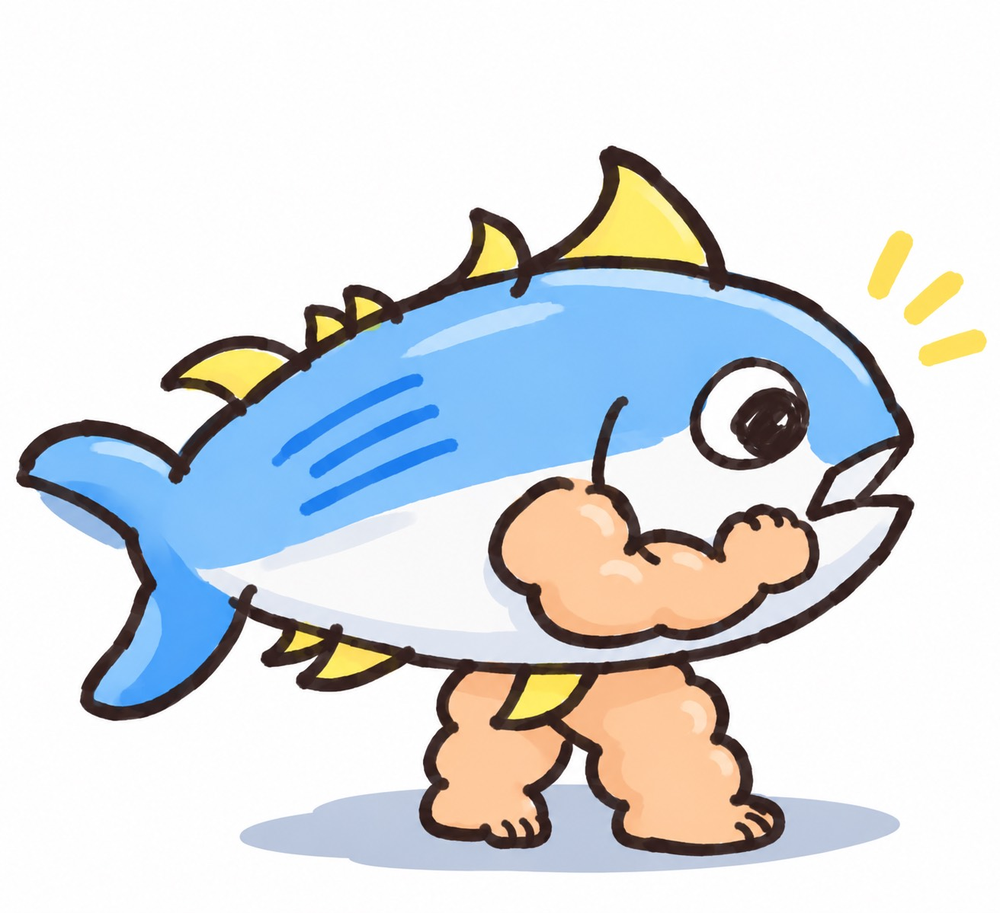 | 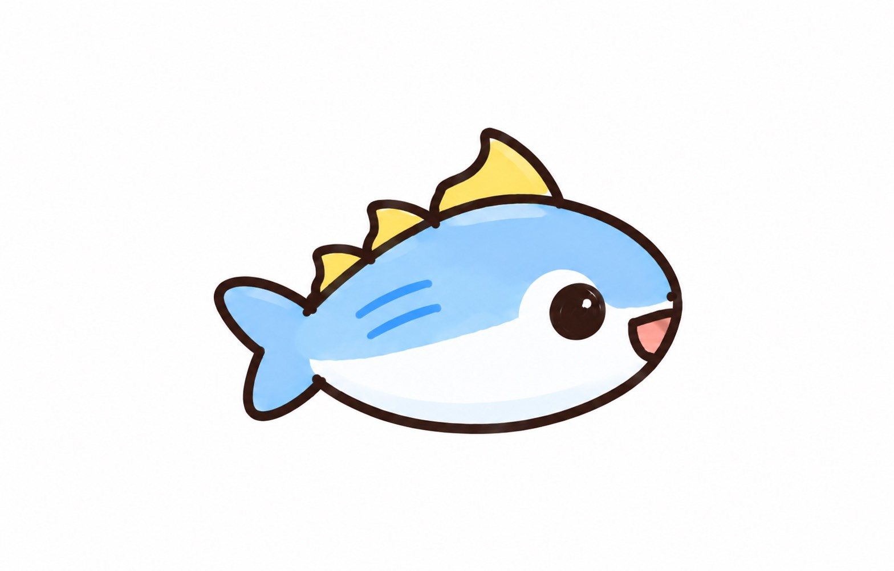 | 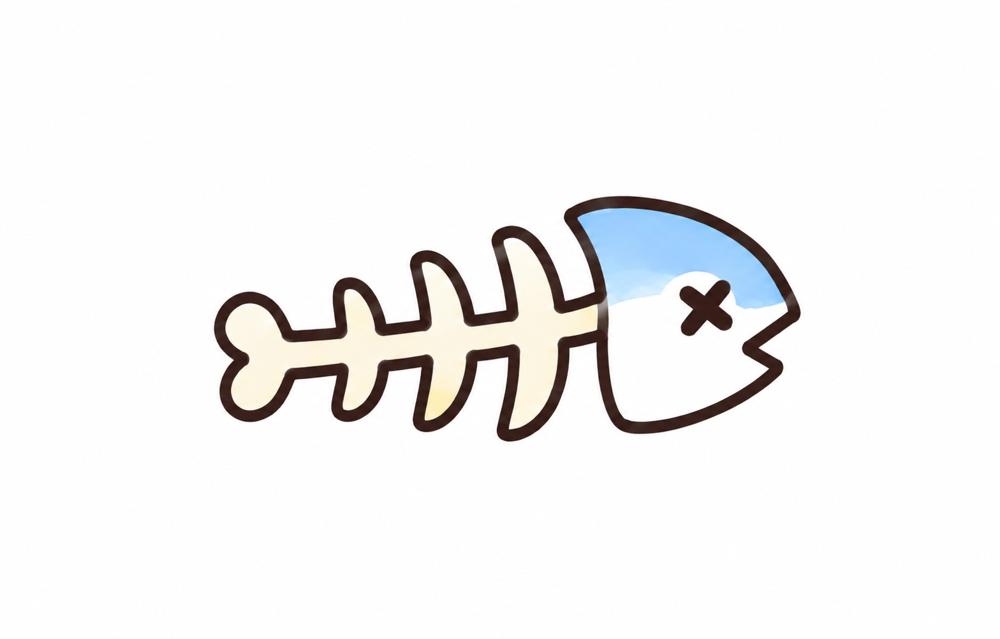 |

骨の画像を親分の敗北表示にも使うことはできるが、「親分の骨化」と「骨の子分の所持」を同じデータとして扱わない。

### 11.2 原本とページ対応

[手書きラフ原本：SPAJAM.pdf](references/SPAJAM.pdf)

| PDFページ | 参照する内容 | 最新の扱い |
|---|---|---|
| 2 | 部屋の入口、ラベルのない缶 | はだ缶・ルーム導線の基準。 |
| 3 | プロフィールを缶ラベルにする発想 | 入力項目は最新指定の三つへ変更。出身などを追加しない。 |
| 4 | チームでの開始待ち | 待機という役割を残す。メンバー一覧の必須化はしない。 |
| 5〜6 | 近づける／QRを使う接続の発想 | 交流の拠点は13ページへ統合。接続方式は別途検討。 |
| 7〜8 | ゲーム開始の場面・缶 | 演出の参考。カウントダウン時間等を自動的に確定しない。 |
| 9 | ミニゲーム中の右下の缶・キャラクター | 配置は採用。ゲーム本体は未決定。 |
| 10 | 缶の上で踊る | 勝利演出の基準。 |
| 11 | 子分登場、よろしく(ツ)ナ | 勝利時の子分登場の基準。ホーム帰還ボタンを追加する。 |
| 12 | 缶へ吸い込まれて戻る | 帰還演出の基準。 |
| 13 | ラベル付きの缶と交流のホーム | メンバーと下部タブを除き、この構図を基準にする。 |
| 14〜15 | チーム綱引き、チーム結果 | 最終戦の参考。計算は普通3・骨1。 |
| 16〜17 | MVP、順位、退出 | 今回のルーム限定にする。算出基準は別途決める。 |

### 11.3 はだ缶からプロフィールラベルへ

手書き2ページにラベルのない缶、3ページにプロフィールとラベルの関係が描かれている。入力項目と即時反映の仕様は、その後のユーザーの修正を優先する。fileciteturn0file0L12-L12 fileciteturn0file0L30-L30

| はだ缶・ルーム入口（p.2） | プロフィールとラベル（p.3） |
|---|---|
| 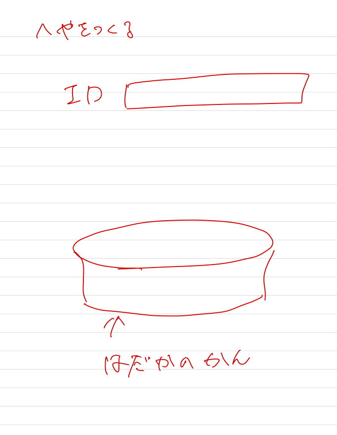 | 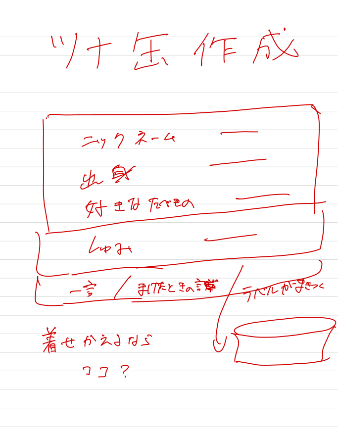 |

### 11.4 ホームとゲーム中の配置

13ページの缶中心の構図、9ページの右下の小さな缶を参照する。13ページに描かれたメンバー表示は最新指示で不要になっている。fileciteturn0file0L107-L107 fileciteturn0file0L76-L76

| ホームの構図（p.13） | ゲーム領域と右下の缶（p.9） |
|---|---|
| 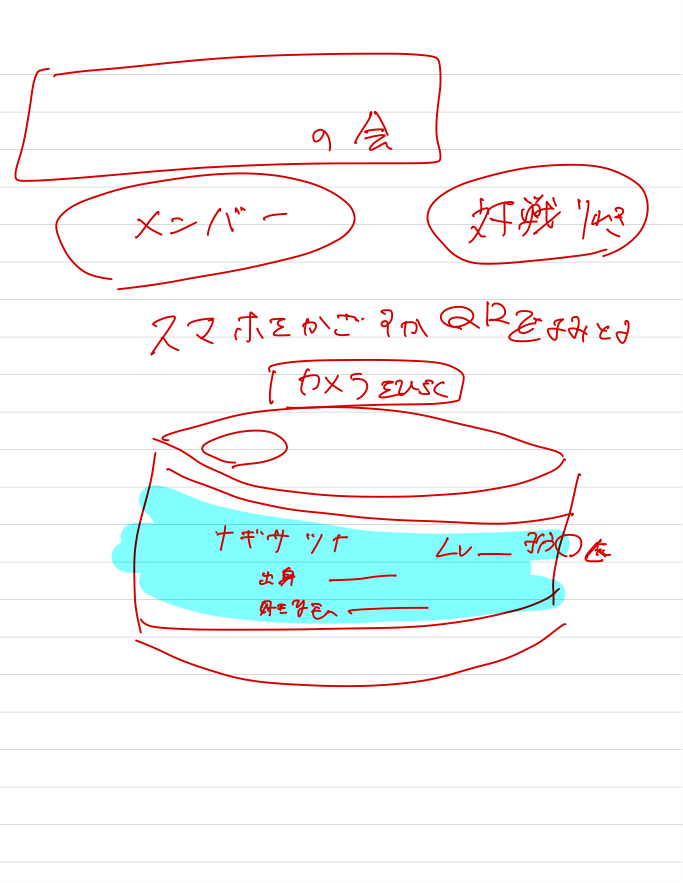 | 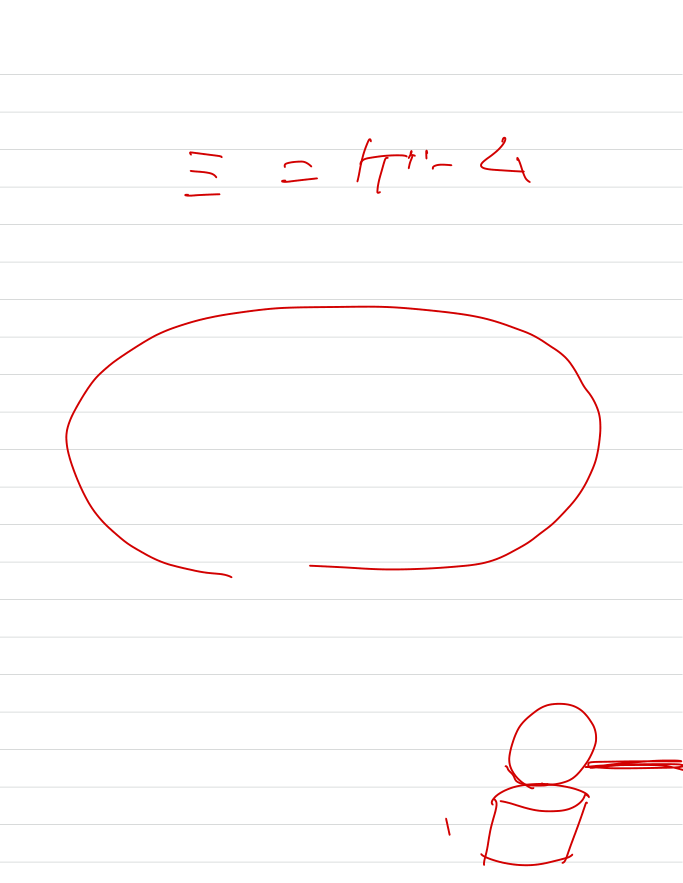 |

### 11.5 勝利・子分登場・帰還

10〜12ページは、勝利後の踊り、子分の登場、缶への帰還を考えるための参考。ボタン位置や自動進行の秒数までは手書きラフから確定しない。fileciteturn0file0L84-L84 fileciteturn0file0L90-L90 fileciteturn0file0L95-L95

| 踊る（p.10） | 子分登場（p.11） | 缶へ戻る（p.12） |
|---|---|---|
| 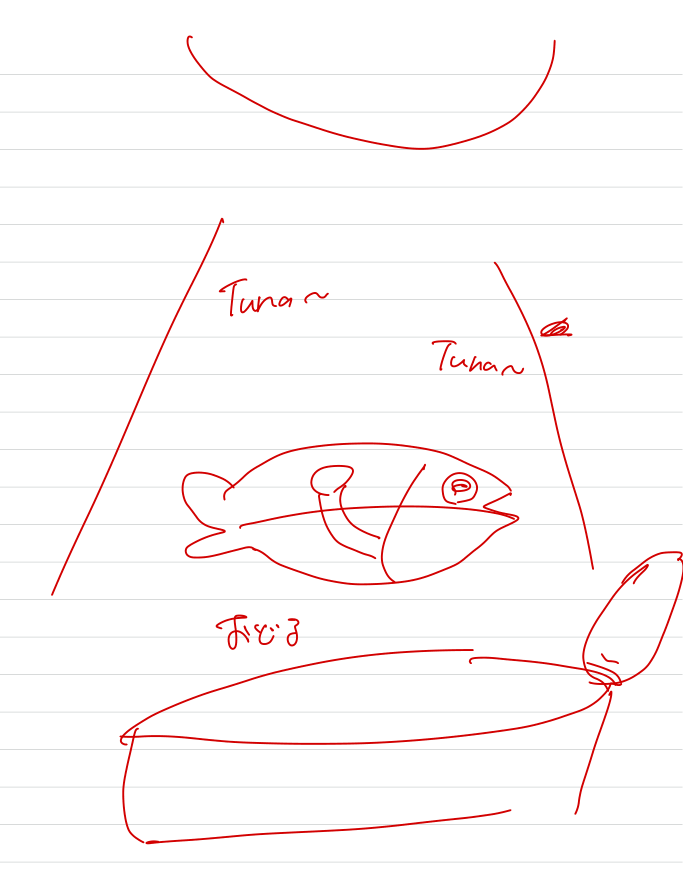 | 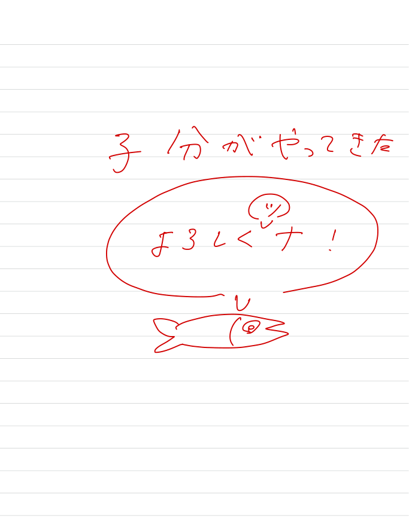 | 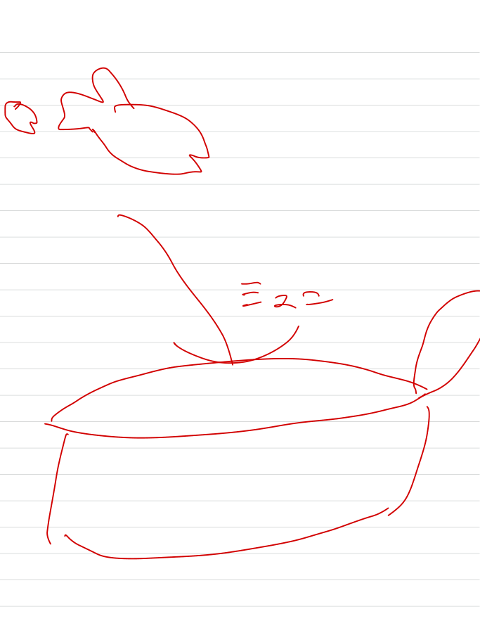 |

### 11.6 最終綱引きとルーム順位

14ページの綱引きと、17ページのランキング・退出を参照する。MVPは16ページに描かれている。fileciteturn0file0L122-L122 fileciteturn0file0L131-L131 fileciteturn0file0L140-L140

| 綱引き（p.14） | MVP（p.16） | ランキング（p.17） |
|---|---|---|
| 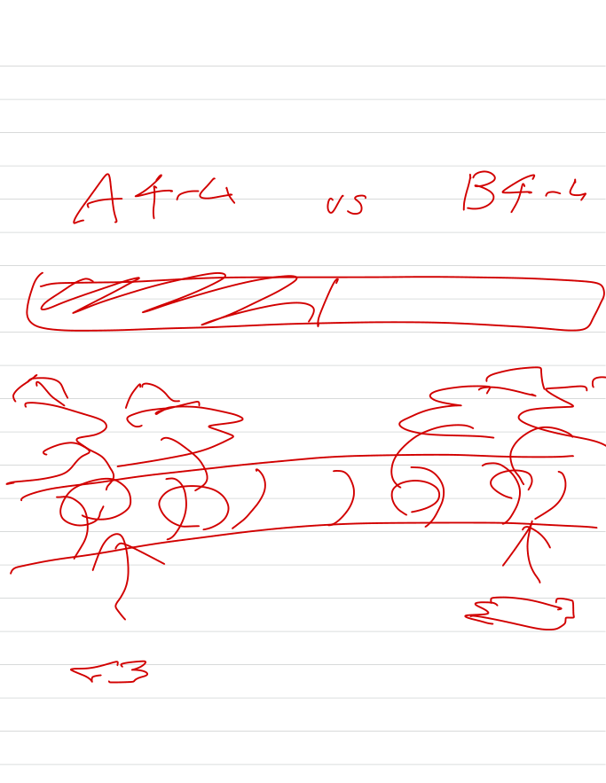 | 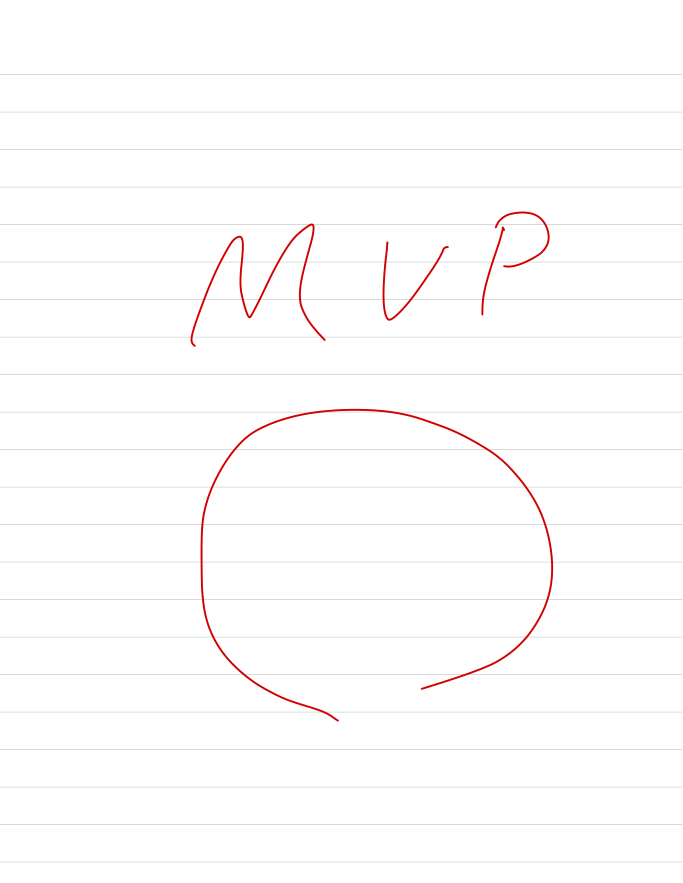 | 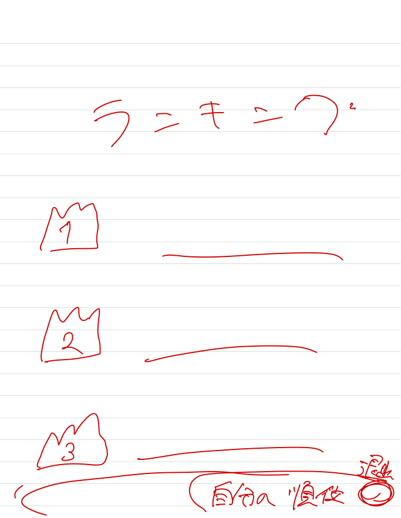 |

### 11.7 過去の生成UI — 全体採用しない参考画像

**以下の画像は修正前のもの。最新版の完成図ではない。** 缶、ラベル、キャラクターの大きさなどを考える参考として同梱する。

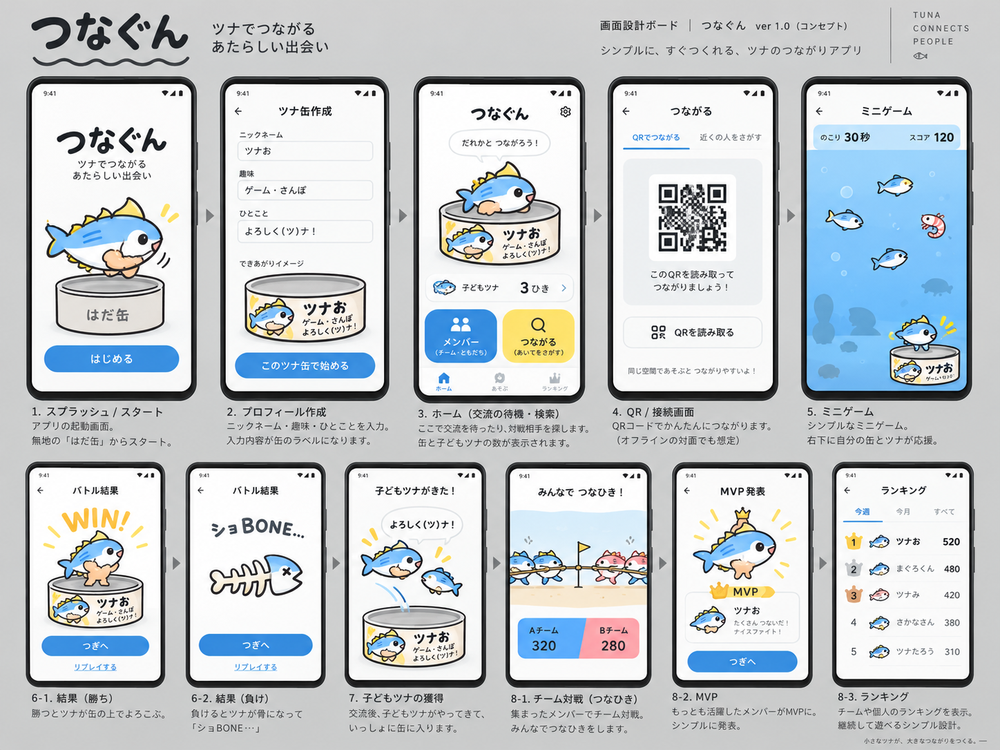

この画像から、以下の要素を取り込まないこと。

- メンバーへのボタン、下部タブ。
- 週間・月間などのランキング期間切替。
- 再戦・リプレイのボタン。
- 魚タップ等の具体的なゲーム。
- 入力済みのサンプル値や、勝手に決められた順位・得点。
- コメント送信、通知、その他の未承認機能。

その他の参考画像：

- [過去のダーク系ボード](references/ui/previous_dark_board.png)
- [過去のフローボード](references/ui/previous_flow_board.png)

いずれも本書の確定事項・変更点より優先しない。黒背景や青い発光を最終採用した資料ではない。

---

## 12. Codexへの実装開始指示

1. 既存リポジトリと適用される `AGENTS.md` を確認する。本書を理由に既存構成や開発者の変更を上書きしない。
2. 本書の確定 C、暫定 P、未決定 U、変更 Xを区別する。暫定案を採用したら、どのPを使ったか作業記録に残す。
3. まず、はだ缶からのプロフィール入力・ラベル即時反映・タブのないホームを実装する。
4. 一台用デモで仮想相手と結果を供給し、勝利・敗北・成長・帰還・最終集計まで確認できるようにする。
5. 対戦・協力ゲームの本体は空けたままにし、後から差し込む境界を設ける。ゲーム内容を独断で完成させない。
6. 同梱画像は参考として読み、特に旧生成画像の未承認機能を移植しない。
7. 通常モードに、結果選択・勝利強制・デモの時間早送りを露出させない。
8. 重大な未決定事項に当たった場合は、該当Uと提案したいPを示す。止まらずに進められる部分は先に実装する。
9. 実装後は、変更ファイル、採用した暫定案、未搭載機能、実施したテスト、未検証の実機・通信事項を分けて報告する。

**最初の到達点は「正式ゲーム以外の体験を、一台で再現できること」。本番用のゲームが完成したとは報告しない。**

---

## 付録：同梱ファイル

```text
tsunagun_design_v2/
├── APP_DESIGN.md                 # 本書
├── CODEX_START.md                # Codexへ渡す短い開始指示
├── README.md                    # 利用方法
├── assets/
│   └── characters/
│       ├── oyabun.png            # ユーザー提供の親分原画
│       ├── kobun_normal.png      # ユーザー提供の普通の子分原画
│       └── kobun_bone.png        # ユーザー提供の骨原画
└── references/
    ├── SOURCE_INDEX.md          # 元ファイルと同梱先の対応
    ├── SPAJAM.pdf               # ユーザー提供の手書きラフ原本
    ├── rough/
    │   └── page-02.png … page-17.png
    └── ui/
        ├── previous_light_board.png
        ├── previous_dark_board.png
        └── previous_flow_board.png
```

会話内の出典マーカーはChatGPT上の参照用。Codexでは同梱PDFのページ番号と相対パスを使って原図を確認できる。
