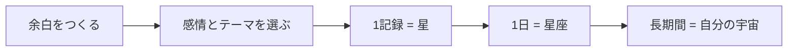
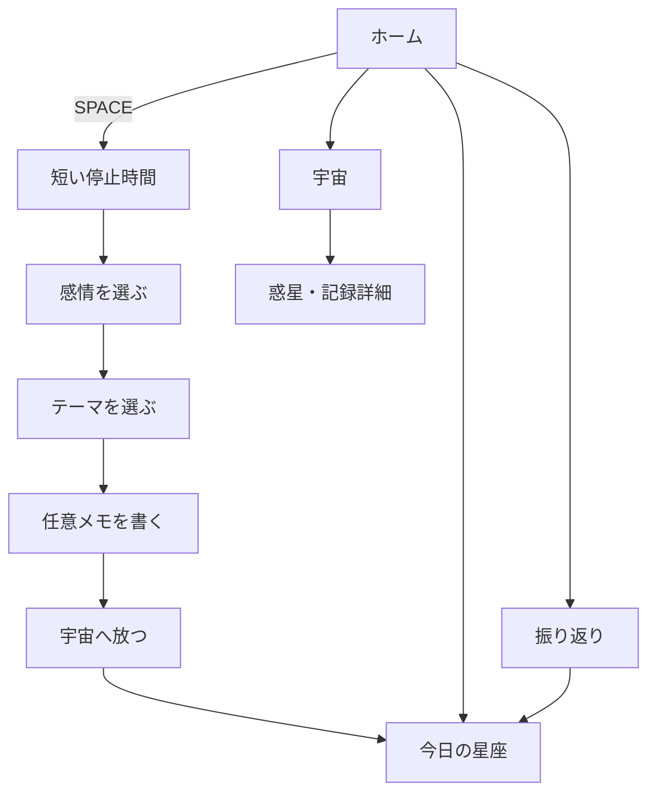

# 「余白」アプリ 開発設計書

> スマホで埋めてしまう数分を、自分の感情に気づく「余白」に変える。

| 項目 | 内容 |
|---|---|
| 文書版 | v1.0 |
| 作成日 | 2026-09-19 |
| 開発人数 | 4人 |
| 想定技術 | Flutter / Dart |
| 主対象 | Android（MVP） |
| アプリ名 | 余白（Yohaku） |
| アプリ内キーワード | SPACE |
| キャッチコピー | 余白が、わたしの宇宙をつくる。 |

---

## 1. この文書の目的

本書は、4人がGitHub上で同時開発しても担当範囲が重ならないように、以下を固定するための設計書である。

- アプリの目的とMVP範囲
- 画面遷移と各画面の責務
- 記録データと宇宙表現のルール
- Flutterプロジェクトの構成
- 4人の担当範囲とファイル所有権
- GitHubでの共同開発ルール
- 各担当の完了条件

本書の内容を開発開始時点の基準とし、仕様変更は口頭だけで進めず、IssueまたはPull Requestに残す。

---

## 2. プロダクト概要

### 2.1 一文での定義

**なんとなくスマホを触ってしまう短い時間を、今の感情に気づき、自分を見つめる「余白」へ変えるアプリ。**

### 2.2 解決したい課題

- SNSやショート動画で、空いた時間を無意識に埋めてしまう
- 忙しさの中で、自分が何を感じていたのか振り返る機会が少ない
- 長文の日記や毎日の習慣化は負担になり、続きにくい
- 「何もしない時間」に罪悪感を抱きやすい

### 2.3 提供する価値

- 30秒〜2分で、今の気持ちを短く残せる
- 一つの記録が星になり、一日の記録が星座になる
- 記録が積み重なると、自分だけの宇宙が育つ
- 良い感情だけでなく、不安や疲れも同じように残せる

### 2.4 主なターゲット

**SNSやショート動画をなんとなく開いてしまい、自分の気持ちを整理する時間が少なくなっている学生〜若い社会人。**

特に、本格的な日記は続かないが、短い振り返りなら試してみたい人を対象とする。

---

## 3. 体験設計の原則

1. **短く終わる**  
   1回の利用は30秒〜2分を目安とする。

2. **強制しない**  
   連続記録、通知による催促、未記録への警告を中心にしない。

3. **ユーザー自身が選ぶ**  
   感情とテーマはAIに自動判定させず、ユーザーが自分で選択する。

4. **感情を評価しない**  
   良い感情もつらい感情も、同じ一つの星として扱う。

5. **競争させない**  
   ランキング、ポイント、ミッション、他者比較を導入しない。

6. **記録した行為を成長として扱う**  
   宇宙が育つ条件は感情の良し悪しではなく、自分を見つめて記録したこととする。

7. **AIは判断者にしない**  
   将来AIを追加する場合も、分類や診断ではなく、振り返りを補助する「鏡」として扱う。

---

## 4. 用語と世界観

| 用語 | アプリ内での意味 |
|---|---|
| 余白 / SPACE | 意図的に立ち止まり、自分の感情を見る短い時間 |
| 星 | 1回分の感情記録 |
| 星座 | 同じ日に生まれた星を時系列につないだもの |
| 惑星 | 「挑戦」「人間関係」など、記録のテーマを表すもの |
| 宇宙 | 長期間の記録と、育った惑星全体 |

変換ルールは次のとおりとする。



---

## 5. MVPの範囲

### 5.1 必須機能（P0）

- ホーム画面
- SPACE記録フロー
- 感情の選択
- テーマの選択
- 200文字以内の任意メモ
- 記録のローカル保存
- 今日の星座表示
- 宇宙・惑星表示
- カレンダーから過去記録を振り返る機能
- 記録詳細の表示
- 記録削除（確認ダイアログ必須）
- アプリ再起動後も記録が残ること

### 5.2 余裕があれば追加する機能（P1）

- 記録後の短い振り返りコメント
- 星や惑星のアニメーション強化
- 惑星ごとの過去記録一覧
- 端末内データの一括削除
- デモ用サンプルデータ投入機能（開発ビルドのみ）

### 5.3 MVPでは実装しないもの

- 本格的なスケジュール管理
- スマホ利用時間の自動監視や強制制限
- SNS、他人との共有、ランキング
- 連続ログイン、ポイント、ミッション
- チャット形式のAI相談
- AIによる感情・テーマの自動分類
- アカウント登録、クラウド同期
- 医療的な診断やメンタルヘルス判定

---

## 6. 感情とテーマ

### 6.1 感情（1つ選択・必須）

内部IDは保存後に変更しない。表示文言や色の微調整は可能とする。

| ID | 表示名 | 意味 | 色の方向性 |
|---|---|---|---|
| `joyful` | うれしい | 喜び、楽しさ、前向き | 黄・金 |
| `calm` | 穏やか | 安心、落ち着き、満足 | 緑・水色 |
| `neutral` | ふつう | 大きな揺れがない | 白・薄いグレー |
| `tired` | 疲れた | 疲労、気力の低下 | 青 |
| `uneasy` | つらい・不安 | 不安、悲しさ、しんどさ | 紫 |

### 6.2 テーマ（1つ選択・必須）

| ID | 表示名 | 例 |
|---|---|---|
| `challenge` | 挑戦 | 新しいこと、努力、目標 |
| `relationships` | 人間関係 | 友人、家族、恋愛、会話 |
| `future` | 将来 | 進路、就職、将来への期待や不安 |
| `workStudy` | 学業・仕事 | 授業、研究、課題、仕事 |
| `self` | 自分自身 | 性格、体調、自信、成長 |
| `dailyLife` | 日常 | 趣味、食事、移動、何気ない出来事 |

テーマを選ぶ行為そのものを自己対話の一部とする。分類精度よりも、ユーザーが「今は何について感じているか」を考えることを優先する。

---

## 7. 基本ユーザーフロー



### 7.1 記録フロー

1. ユーザーが「SPACE」ボタンを押す
2. 数秒だけ立ち止まる画面を表示する
3. 今の感情を1つ選ぶ
4. 何についての感情か、テーマを1つ選ぶ
5. 必要なら200文字以内で言葉を残す
6. 「宇宙へ放つ」を押す
7. 星が生まれる演出を表示する
8. 今日の星座画面へ移動する

停止画面はスキップ可能とし、ユーザーに休息を強制しない。

---

## 8. 画面仕様

### 8.1 共通ナビゲーション

- 下部ナビゲーション：`ホーム / 今日 / 宇宙 / 振り返り`
- 中央または目立つ位置に共通の「SPACE」ボタンを置く
- SPACE画面は下部ナビゲーションの外側に全画面表示する
- 戻る操作で入力内容が失われる場合は確認を出す

### 8.2 ホーム画面

**目的：** アプリを開いた直後に落ち着ける場所と、SPACEへの入口を提供する。

表示内容：

- アプリ名または短いメッセージ
- 今日の宇宙・星座の簡易プレビュー
- SPACE開始ボタン
- 今日の星座、宇宙、振り返りへの導線
- 記録がない場合の静かな空表示

禁止事項：

- 連続日数を大きく表示しない
- 「今日はまだ記録していません」など、未記録を責める表現を使わない

### 8.3 SPACE画面

**目的：** 30秒〜2分で一つの星を生み出す。

内部ステップ：

1. `pause`：短い停止時間
2. `emotion`：感情選択
3. `category`：テーマ選択
4. `note`：任意メモ
5. `complete`：星生成演出

入力条件：

- 感情：必須、1つ
- テーマ：必須、1つ
- メモ：任意、0〜200文字
- 保存ボタン連打による二重登録を防ぐ

保存成功後：

- 入力をリセットする
- 星生成演出を表示する
- 今日の日付を指定して星座画面へ遷移する

保存失敗時：

- 入力内容を保持する
- 再試行できるメッセージを表示する

### 8.4 今日の星座画面

**目的：** 一日の感情の流れを、星のつながりとして眺める。

表示ルール：

- 指定日がなければ今日を表示する
- 星は記録時刻順に並べて線で結ぶ
- 星の色は感情に対応させる
- 位置は記録IDと並び順から決め、再表示しても大きく変わらないようにする
- 星が1個の場合は線を描かない
- 星が0個の場合は空の宇宙とSPACEへの導線を表示する
- 星をタップすると、時刻・感情・テーマ・メモを表示する

### 8.5 宇宙画面

**目的：** 長期間の記録を、テーマ別に育つ惑星として眺める。

表示ルール：

- 6テーマを6つの惑星として表示する
- 記録数0のテーマは、小さく暗い「まだ眠っている惑星」として表示する
- 記録数が増えるほど惑星が段階的に成長する
- 良い感情だけでなく、すべての感情を同じ1件として成長に加える
- 惑星をタップすると、そのテーマの記録一覧を表示する

成長段階：

| 段階 | 記録数 | 表現 |
|---|---:|---|
| 0 | 0 | 眠っている |
| 1 | 1〜4 | 小さな惑星 |
| 2 | 5〜14 | 育った惑星 |
| 3 | 15以上 | 豊かな惑星 |

記録数は成長計算に使うが、競争を促さないため画面上で強調しない。

### 8.6 振り返り画面

**目的：** 過去の感情を、日付から静かに振り返る。

表示内容：

- 月単位のカレンダー
- 記録がある日の印
- 選択日の感情・テーマの簡易一覧
- 選択日の星座画面への導線
- 記録詳細と削除操作

削除時は確認ダイアログを表示する。削除後は星座、惑星、一覧へ即時反映する。

---

## 9. ルーティング仕様

ルート名は骨組み作成時に固定し、各担当者は変更しない。

| パス | 画面 | 備考 |
|---|---|---|
| `/` | リダイレクト | `/home`へ移動 |
| `/home` | ホーム | 下部ナビゲーション内 |
| `/space` | SPACE | 全画面表示 |
| `/constellation` | 星座 | `date=YYYY-MM-DD`を任意指定 |
| `/universe` | 宇宙 | 下部ナビゲーション内 |
| `/history` | 振り返り | 下部ナビゲーション内 |

例：`/constellation?date=2026-09-19`

---

## 10. データ仕様

### 10.1 `SpaceRecord`

```dart
class SpaceRecord {
  final String id;
  final DateTime createdAt;
  final EmotionType emotion;
  final CategoryType category;
  final String note;

  const SpaceRecord({
    required this.id,
    required this.createdAt,
    required this.emotion,
    required this.category,
    required this.note,
  });
}
```

制約：

- `id`：UUID、一意、空文字不可
- `createdAt`：端末の現在日時。ISO 8601文字列で保存
- `emotion`：定義済みの5種類のいずれか
- `category`：定義済みの6種類のいずれか
- `note`：0〜200文字。保存前に前後の空白を除去

### 10.2 派生データ

星座、惑星、日別一覧は別データとして保存せず、`SpaceRecord`の一覧から計算する。

- 今日の星座：同一ローカル日付の記録を抽出し、`createdAt`昇順に並べる
- 惑星の成長：同一`category`の記録件数を数える
- カレンダーの印：日付ごとの記録有無を計算する

この方式により、削除後の不整合を防ぐ。

### 10.3 Repository契約

```dart
abstract interface class SpaceRepository {
  Future<List<SpaceRecord>> getAll();
  Future<void> save(SpaceRecord record);
  Future<void> deleteById(String id);
}
```

MVPでは端末内にJSONとして保存する。保存先の実装を画面から隠すため、全画面はRepositoryを直接生成せず、共通Provider経由で利用する。

### 10.4 保存方針

- MVP：`shared_preferences`にJSON配列として保存
- 保存キー：`space_records_v1`
- バージョン変更時に備えてキーに`v1`を含める
- ユーザーのメモ本文をログへ出力しない
- 通信やクラウド送信は行わない

---

## 11. 技術方針

### 11.1 採用構成

| 用途 | 方針 |
|---|---|
| UI | Flutter / Material 3 |
| ルーティング | `go_router` |
| 状態管理 | `flutter_riverpod` |
| ローカル保存 | `shared_preferences` + JSON |
| ID生成 | `uuid` |
| 日付表示 | `intl` |
| カレンダー | `table_calendar` |

依存パッケージはPhase 0でリードが追加し、その後は各担当者が`pubspec.yaml`を直接変更しない。

### 11.2 レイヤー

- `app/`：アプリ起動、テーマ、ルーター、共通シェル
- `core/`：モデル、Repository、Provider、共通部品
- `features/`：各画面固有のUIと状態

各Featureは、他のFeatureを直接importしない。共有が必要な型や処理は、リードが`core/`へ追加する。

---

## 12. ディレクトリ構成

```text
lib/
├── main.dart
├── app/
│   ├── app.dart
│   ├── router.dart
│   ├── app_shell.dart
│   └── theme.dart
├── core/
│   ├── constants/
│   │   ├── app_routes.dart
│   │   └── design_tokens.dart
│   ├── models/
│   │   ├── emotion_type.dart
│   │   ├── category_type.dart
│   │   └── space_record.dart
│   ├── repositories/
│   │   ├── space_repository.dart
│   │   └── local_space_repository.dart
│   ├── providers/
│   │   └── space_records_provider.dart
│   ├── utils/
│   │   └── date_key.dart
│   └── widgets/
│       ├── space_background.dart
│       ├── empty_state.dart
│       └── error_state.dart
└── features/
    ├── home/
    │   ├── pages/
    │   │   └── home_page.dart
    │   └── widgets/
    ├── space/
    │   ├── pages/
    │   │   └── space_page.dart
    │   ├── controllers/
    │   │   └── space_form_controller.dart
    │   └── widgets/
    ├── constellation/
    │   ├── pages/
    │   │   └── constellation_page.dart
    │   ├── painters/
    │   │   └── constellation_painter.dart
    │   └── widgets/
    ├── universe/
    │   ├── pages/
    │   │   └── universe_page.dart
    │   └── widgets/
    └── history/
        ├── pages/
        │   └── history_page.dart
        └── widgets/

assets/
├── common/
├── home/
├── space/
├── constellation/
├── universe/
└── history/

test/
├── core/
└── features/
    ├── home/
    ├── space/
    ├── constellation/
    ├── universe/
    └── history/
```

`assets/`全体をPhase 0で登録しておき、各担当は自分のFeature用フォルダだけに素材を追加する。

---

## 13. 4人の担当分け

### 13.1 担当表

| 担当 | 機能 | 編集してよい主な場所 | 主な成果物 |
|---|---|---|---|
| A（リード） | 骨組み + ホーム | `app/`, `core/`, `features/home/`, `assets/common/`, `assets/home/` | 共通基盤、ルーター、ホーム |
| B | SPACE | `features/space/`, `assets/space/`, 対応テスト | 記録フロー、保存、星生成演出 |
| C | 今日の星座 | `features/constellation/`, `assets/constellation/`, 対応テスト | 星座描画、日別表示、詳細 |
| D | 宇宙 + 振り返り | `features/universe/`, `features/history/`, 対応アセット・テスト | 惑星、カレンダー、過去記録 |

### 13.2 A（リード）のPhase 0作業

全員が機能実装を始める前に、Aが以下を完成させて`develop`へ反映する。

- Flutterプロジェクトと依存パッケージ
- 本書どおりのフォルダ構成
- 5画面の空ページ
- 固定済みルーティング
- 共通下部ナビゲーションとSPACEボタン
- テーマ、色、文字スタイルの基本値
- `EmotionType`、`CategoryType`、`SpaceRecord`
- `SpaceRepository`とローカル実装
- 全画面で利用する`spaceRecordsProvider`
- 各アセットフォルダの登録
- 最低限のCIまたは共通確認コマンド

Phase 0の完了後にタグまたはコミットを示し、全員は同じ`develop`からFeatureブランチを作る。

### 13.3 ファイル所有ルール

- `app/`、`core/`、`main.dart`、`pubspec.yaml`はAだけが編集する
- B・C・Dは、自分のFeatureディレクトリと対応するアセット・テストだけを編集する
- Feature間の直接importは禁止する
- 共通部に変更が必要な場合、担当者はIssueへ要望を書く
- Aが共通部を別PRで変更し、各担当者は更新後の`develop`を取り込む
- 例外的に所有外ファイルを触る場合は、作業前に全員へ共有する

これにより、画面ファイルだけでなく`router.dart`、`pubspec.yaml`、モデルの競合も防ぐ。

---

## 14. 各担当の実装タスクと完了条件

### 14.1 担当A：骨組み + ホーム

タスク：

- Phase 0の共通基盤を作成する
- ホーム画面を実装する
- 下部ナビゲーションと共通SPACEボタンを実装する
- 読み込み中、空、エラーの共通状態を用意する

完了条件：

- 5画面すべてへ遷移できる
- 再起動後もRepositoryから記録を読み込める
- 記録0件でもホームが崩れない
- `flutter analyze`と共通テストが成功する

### 14.2 担当B：SPACE

タスク：

- 5段階の記録フローを実装する
- 感情とテーマの選択UIを作る
- 200文字制限と残り文字数を表示する
- 共通Providerを通して保存する
- 保存中の二重送信を防ぐ
- 保存成功時の星生成演出を作る

完了条件：

- 必須項目が未選択なら保存できない
- メモなしでも保存できる
- 200文字を超えて入力できない
- 保存した内容がProviderへ即時反映される
- 保存失敗時に入力が消えない

### 14.3 担当C：今日の星座

タスク：

- 指定日の記録を時刻順に抽出する
- 星と接続線を描画する
- 感情に応じて星の色を変える
- 星タップで記録詳細を表示する
- 0件、1件、複数件の表示を整える

完了条件：

- 同じ記録は再表示しても同じ位置関係になる
- 1件では不要な線を描かない
- 削除後に表示が即時更新される
- 過去日付をクエリで受け取れる

### 14.4 担当D：宇宙 + 振り返り

タスク：

- 6テーマの惑星を表示する
- 記録数から4段階の成長状態を計算する
- 惑星タップでテーマ別記録を表示する
- カレンダーと記録日の印を実装する
- 選択日の記録一覧と星座への導線を作る
- 確認つき削除を実装する

完了条件：

- 感情の種類に関係なく惑星が成長する
- 記録0件の惑星も世界観を保って表示される
- 日付選択と一覧内容が一致する
- 削除が宇宙、カレンダー、星座へ即時反映される

---

## 15. GitHub運用

### 15.1 ブランチ構成

```text
main
└── develop
    ├── feature/home
    ├── feature/space
    ├── feature/constellation
    └── feature/universe-history
```

- `main`：発表・提出可能な安定版
- `develop`：統合確認用
- `feature/*`：各担当者の作業用

### 15.2 開発開始手順

1. AがPhase 0を`develop`へマージする
2. 全員が最新の`develop`を取得する
3. 各自が担当Featureブランチを作る
4. 担当ディレクトリ内だけで実装する
5. 完成後、`develop`向けPull Requestを作る
6. レビューと動作確認後にマージする
7. 全機能の統合確認後、`develop`から`main`へマージする

### 15.3 Pull Requestの条件

各PRに以下を含める。

- 実装した内容
- 変更したファイルの範囲
- 動作確認手順
- 画面のスクリーンショットまたは録画
- 既知の未対応事項
- `flutter analyze`の成功
- `flutter test`の成功

1つのPRに別担当の機能や無関係な整形を混ぜない。

### 15.4 コミット例

```text
feat(space): add emotion selection step
feat(constellation): draw stars in chronological order
fix(history): refresh records after deletion
test(core): add SpaceRecord serialization tests
docs: clarify feature ownership rules
```

### 15.5 コンフリクトを防ぐための約束

- 依存追加はAへ依頼する
- ルート追加・変更はAへ依頼する
- 共通モデルの変更はAへ依頼する
- 大規模な自動整形を機能PRに含めない
- 作業開始前とPR作成前に`develop`の更新を取り込む
- コンフリクト解消で他人の変更を削除しない

---

## 16. テスト計画

### 16.1 Unit Test

- `SpaceRecord`のJSON変換
- 感情・テーマIDの復元
- 日付ごとの抽出
- 時刻順ソート
- テーマごとの件数集計
- 惑星の成長段階判定
- Repositoryの保存・削除

### 16.2 Widget Test

- 各画面の0件表示
- SPACEの必須項目バリデーション
- 200文字制限
- 星座の0件・1件・複数件表示
- カレンダーの日付選択
- 削除確認ダイアログ

### 16.3 統合確認シナリオ

1. 初回起動でホームが表示される
2. SPACEから「疲れた」「学業・仕事」、任意メモを保存する
3. 星が生成され、今日の星座に表示される
4. 学業・仕事の惑星が成長する
5. 振り返りの今日の日付に印がつく
6. アプリを再起動しても記録が残る
7. 記録を削除すると、すべての画面から消える

---

## 17. デザイン指針

- 暗い宇宙色を基調にし、文字の可読性を優先する
- 星や惑星は鮮やかにするが、情報量は増やしすぎない
- 余白を広く取り、1画面に一つの判断を基本とする
- 激しい演出、強い警告色、焦らせるカウントダウンを避ける
- 感情を「正解／不正解」「良い／悪い」と表現しない
- ボタンや文字はAndroid実機で押しやすいサイズにする
- 色だけで感情を区別せず、ラベルやアイコンも併用する

---

## 18. プライバシーとAI

### 18.1 MVP

- 記録は端末内だけに保存する
- アカウント登録や外部送信を行わない
- メモ本文をデバッグログ、分析ログ、クラッシュログへ出さない
- 本アプリは医療診断や治療を目的としない

### 18.2 AIを追加する場合

AIは必須機能が完成した後に検討する。追加する場合も以下を守る。

- 感情やテーマはユーザーの選択を正とする
- AIは短い振り返りコメントの生成だけに使う
- 診断、断定、説教、行動の強制をしない
- 外部送信前に、送信内容と目的をユーザーへ明示する
- APIキーをFlutterアプリへ直接埋め込まない
- AI失敗時も記録機能は利用できる

---

## 19. 開発フェーズ

### Phase 0：骨組み（A）

共通モデル、保存、Provider、ルーター、テーマ、空画面を作成する。

### Phase 1：機能別並行開発（A〜D）

各担当者が所有ディレクトリ内で機能を実装する。

### Phase 2：統合

PRを`develop`へ集約し、記録追加・削除が全画面へ反映されることを確認する。

### Phase 3：演出・品質向上

アニメーション、文言、実機レイアウト、アクセシビリティを調整する。

### Phase 4：発表準備

デモシナリオ、サンプルデータ、スクリーンショット、説明スライドを準備する。

---

## 20. MVP完成の定義

以下をすべて満たした時点でMVP完成とする。

- 5つの主要画面が実機で遷移できる
- 2分以内に感情・テーマ・任意メモを記録できる
- 記録が星として今日の星座へ表示される
- 記録のテーマに対応する惑星が成長する
- 過去記録をカレンダーから確認できる
- アプリ再起動後も記録が残る
- 記録を削除すると全画面へ反映される
- 良い感情とつらい感情を同じ価値の記録として扱う
- ランキング、連続記録、未記録ペナルティがない
- `flutter analyze`と`flutter test`が成功する
- 4人の担当範囲がファイル単位で分離されている

---

## 21. 他のAIへ骨組み作成を依頼するときの指示

以下を依頼文の先頭に添える。

> この設計書を唯一の仕様基準として、まずPhase 0のFlutter骨組みだけを作成してください。5画面は空の状態でも遷移可能にし、共通モデル、Repository、Riverpod Provider、ルーティング、テーマ、アセット登録、テストの土台まで実装してください。Feature固有の完成UIはまだ作り込まないでください。`app/`と`core/`を安定させ、4人がそれぞれのFeatureディレクトリだけを編集して並行開発できる状態を完成条件とします。設計書と異なる判断が必要な場合は、実装前に理由と選択肢を提示してください。

---

## 22. 現時点の固定事項

- 感情とテーマはユーザーが選択する
- 1記録を星、1日を星座、長期記録を宇宙として扱う
- 惑星はテーマを表す
- 記録したこと自体で宇宙が育つ
- 4人の担当は「ホーム」「SPACE」「今日の星座」「宇宙 + 振り返り」
- Aが最初に共通骨組みを作る
- 作業ファイルはFeature単位で分割する
- 共通ファイルはAが管理する
- GitHubでは`feature/* → develop → main`の順で統合する

この固定事項を変更する場合は、実装前に4人で合意し、本書を更新する。
